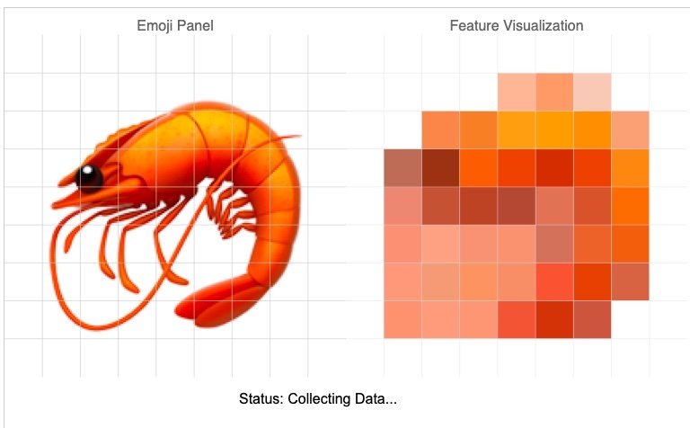

# Emoji Trainer

**Emoji Trainer** is an interactive, browser-based project that demonstrates how computers can learn to classify and recognize emojis by extracting simple visual features, using JavaScript, p5.js, and TensorFlow.js.

## Features

- **Emoji Classification:** Recognizes a wide variety of emojis using a neural network trained entirely in-browser.
- **Configurable Vision Grid:** Users can adjust how the AI "sees" by changing the grid resolution with a live slider and manual fields.
- **Live Data Collection & Training:** Collect data, train a neural network, and watch loss/accuracy metrics update—all within the web UI.
- **Interactive Prediction:** Watch the model predict the emoji and compare its guess with the ground truth.
- **Live UI Sync:** Interface syncs with global model state—including all controls and status—on start and reset, handling edge cases robustly.
- **Modern Design:** UI uses modern CSS with vertical rhythm, card/panel layouts, enhanced control elements, and a live status badge.
- **Educational Focus:** Visualizes features, neural network outputs, and the full step-by-step ML process.

## Technologies Used

- [p5.js](https://p5js.org/): For interactive graphics, UI, and rendering.
- [TensorFlow.js](https://www.tensorflow.org/js): All neural network operations in-browser.
- **JavaScript:** UI and logic controllers.

## How It Works

1. **Set Vision Resolution:** Use the slider or manual fields to select the number of rows/columns in the vision grid (simulates low-to-high resolution input).
2. **Collect Data:** The app cycles through emojis, extracting color grid features and building a dataset.
3. **Train Model:** A small neural network is trained on the collected dataset to map features to the correct emoji.
4. **Predict:** The system tries to guess new emoji images based on what it has learned.

## Project Structure

- `index.html`: Main page and UI layout.
- `sketch.js`: Main interface logic, workflow, feature extraction.
- `style.css`: Modern CSS styles (vertical rhythm, card layouts, buttons, etc.).
- `ml/`
  - Model setup, training, inference code.
- `libs/`
  - `tf.min.js`: TensorFlow.js for browser ML.
  - `p5.min.js`: p5.js for User interface
- `data/emojis.js`: Contains emoji list.
- `screenshots/`: Example images for docs/readme.

## Usage

Open `index.html` in your browser. No install or server needed (provided your browser supports ES6 and local JS loading).  
**Note:** Some browsers have strict local file security that may prevent full functionality; Chrome with proper flags or Firefox is recommended.

## 📸 Screenshots

<table>
  <tr>
    <td align="center"><strong>🦐 Emoji Panel and what the model "sees"</strong>  <em>Status: Collecting Data</em></td>
  </tr>
</table>

<table>
  <tr>
    <td align="center"><strong>✨ Prediction with Feature Mapping</strong>  <em>Actual: 🪄 | Predicted: 🪄</em></td>
  </tr>
</table>

---

<table>
  <tr>
    <td align="center" colspan="2"><strong>⏳ Model Training Phase</strong></td>
  </tr>
  <tr>
    <td align="center" colspan="2"> <em>Status: Training Model...</em></td>
  </tr>
</table>

---

<table>
  <tr>
    <td align="center"><strong>⚠️ Incorrect Prediction</strong>  <em>Actual: 🧥 | Predicted: 🌻 </em></td>
    <td align="center"><strong>🧩 Another Prediction Example</strong>  <em>Actual: 🧩 | Predicted: 🔋</em></td>

  </tr>
</table>

## Features to add

1. Allow users to "draw" emojis for the model to classify.

## Credits

- Inspired by ML education projects and visualizations such as [Teachable Machine](https://teachablemachine.withgoogle.com/).
- [Built with Goose](https://block.github.io/goose/)
- https://www.favicon.cc/

## License

MIT License (see LICENSE file for details).

---

*Happy Learning!*
